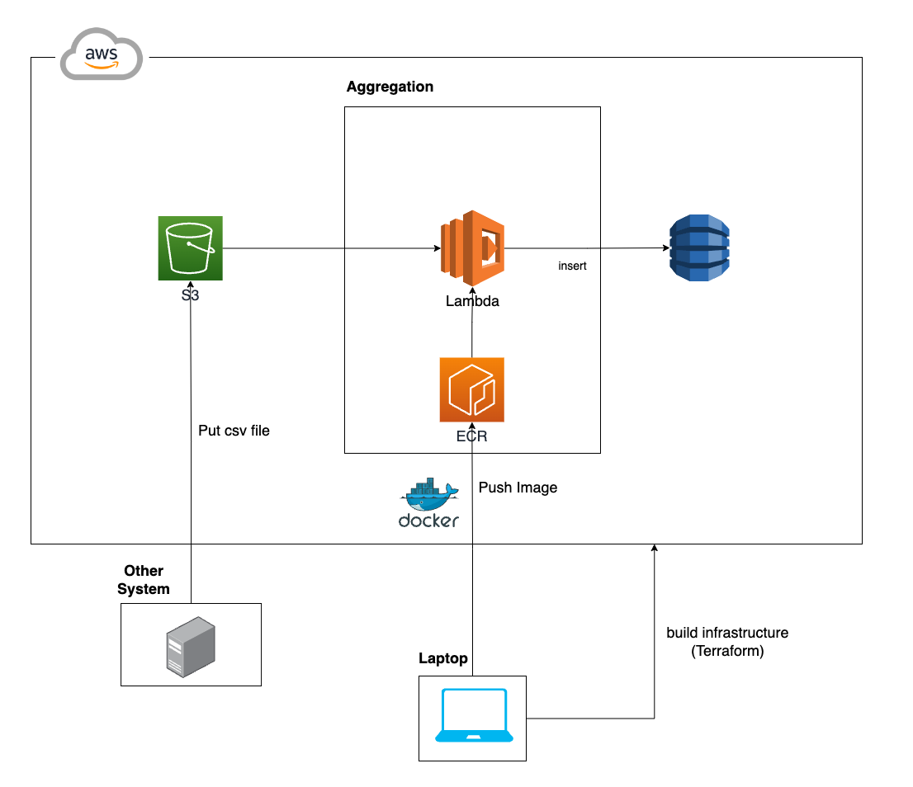
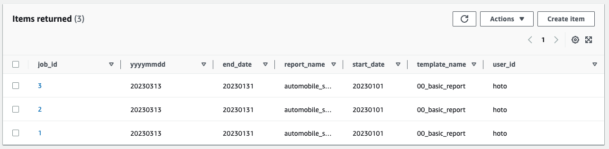
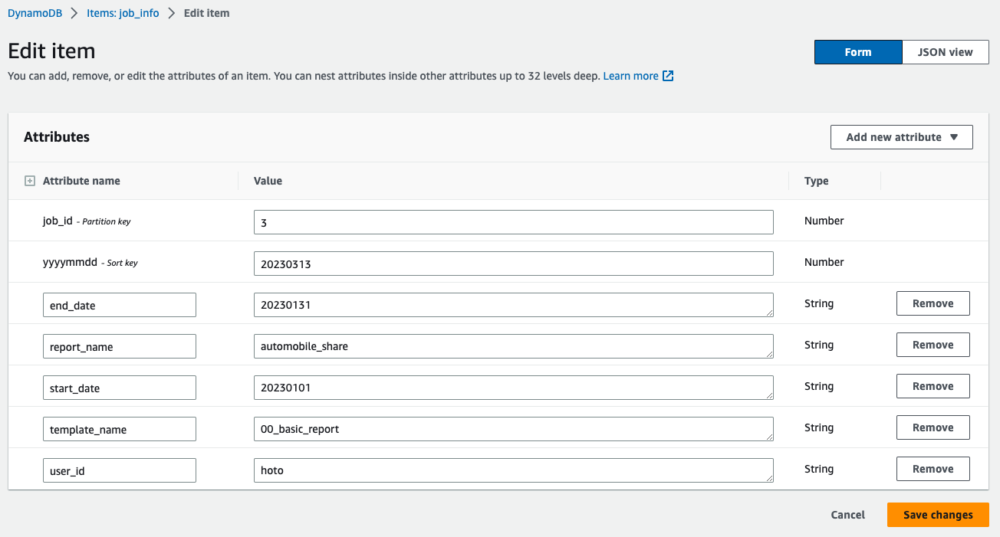

# Manipulation Dynamo DB

## System Architecture



## How to Use?

### build infrastructure

This bash file build whole infrastructure on AWS, using Terraform files in `infrastracture/`.

```bash
sh build.sh
```

### deploy app image

This bash file works like below:

* Build Docker Image for lambda using python code in `app/`.

* Push the image to ECR repository.

```bash
sh deploy.sh
```


## How it works?

* `csv put` triggers Lambda

* Lambda read csv and defines `job_id` for processing task

* Lambda insert the data into Dynamo DB table, with assigned `job_id`.


**Table Overview**




**Record**

(where job_id = 3)


